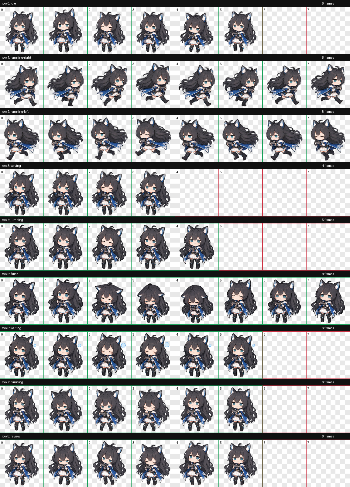

# 陈千语（小陈） · Codex Pet

A soft chibi anime companion for Codex, with black cat ears, long dark hair, a blue cape and a tiny keyboard.

## Install

```bash
npx petdex@latest install chen-qianyu-3
```

The Petdex entry is `chen-qianyu-3`; the package ID remains `chen-qianyu`.

For the package in this repository, download [`dist/chen-qianyu-petdex.zip`](dist/chen-qianyu-petdex.zip), or copy the `pet` files locally:

```powershell
$petDir = Join-Path $env:USERPROFILE '.codex/pets/chen-qianyu-3'
New-Item -ItemType Directory -Force -Path $petDir
Copy-Item -LiteralPath './pet/pet.json', './pet/spritesheet.webp' -Destination $petDir -Force
```

Reselect **陈千语（小陈）** in Codex's pet settings to refresh the artwork. Restart Codex if it still displays a cached version.

## 2026-10-01: calmer loops

The animation set adds coordinated body and facial changes. The latest revision rebuilds three short loops around restrained, continuous poses:

| Native slot | Visible action | Frames |
| --- | --- | ---: |
| `idle` | Breathing and blinking | 6 |
| `running-right` | Rightward run | 8 |
| `running-left` | Leftward run | 8 |
| `waving` | Same hand stays raised; only the wrist waves | 4 |
| `jumping` | Affectionate head tilt and closed-eye smile, with feet planted | 5 |
| `failed` | Surprise, disappointment and recovery | 8 |
| `waiting` | Bored blink and a small expanding/contracting bubble | 6 |
| `running` | Focused typing | 6 |
| `review` | Thoughtful glance and nod | 6 |

The `jumping` and `waiting` state triggers remain native; their artwork has changed. Codex controls the fixed frame counts and playback durations. This package does not extend those durations.

| Small wave | Affectionate tilt | Bored bubble |
| --- | --- | --- |
|  |  |  |



All nine GIF previews are in [`previews/`](previews/).

## Format and validation

- Codex v1 atlas: 1536 × 1872, 8 columns × 9 rows, 192 × 208 per cell.
- 57 used frames; unused cells are transparent. Lossless RGBA WebP.
- [Atlas validation](qa/validation.json), [frame inspection](qa/review.json) and [edge cleanup](qa/edge-cleanup.json) passed.
- [Independent visual review](qa/visual-review.md) checked hand continuity, supported keyboard, planted feet and loop boundaries in the three revised rows.
- Browser preview checks confirmed the 4-, 5- and 6-frame sequences wrap to their first frames. Actual desktop state triggers and cache refresh still depend on the installed Codex build.
- Minor limitation: the bubble contracts more visibly between frames 4 and 5 than in its other steps.

Diagnostic references to `extracted-frames/` and `assembly/` describe intermediate files; they are not required for installation.

## License

[MIT](LICENSE).
